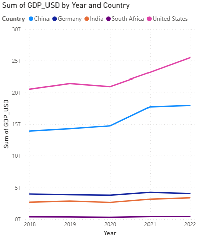
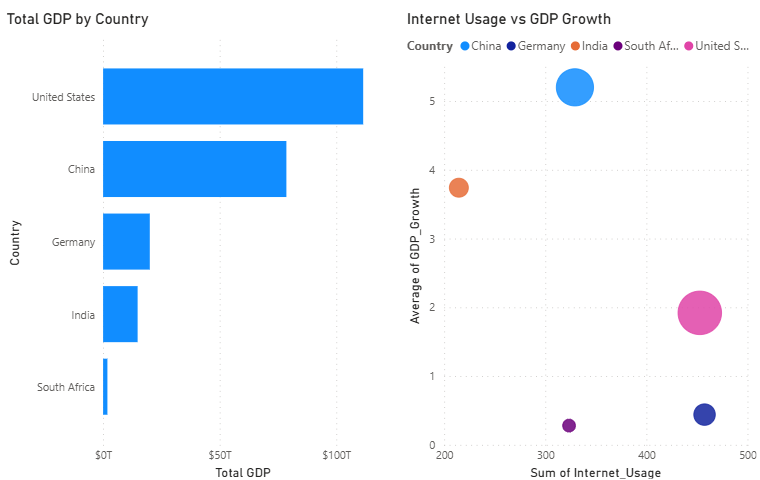

# 🌍 World Bank BI Analysis

## 📌 Overview

This project presents an end-to-end Business Intelligence analysis of global economic indicators using SQL Server and Power BI. The dashboard explores GDP performance, economic growth, unemployment trends, and country-level comparisons to support data-driven economic analysis.

---

## 🛠️ Tools Used

- SQL Server
- Power BI
- Power Query
- Microsoft Excel

---

## 📊 Dashboard Features

- KPI cards for Total GDP, Average GDP Growth, and Average Unemployment
- GDP trend analysis over time
- Country-level GDP comparison
- Internet Usage vs GDP Growth analysis
- Interactive country filtering and slicers

---

## 💡 Key Insights

1. The United States and China accounted for the largest share of total GDP among the countries analyzed.
2. GDP growth rates varied significantly across countries, highlighting differences in economic performance.
3. Internet usage generally increased alongside economic development, suggesting a positive relationship between digital adoption and economic activity.
4. Unemployment levels differed considerably across countries, indicating varying labour market conditions.
5. Country-level comparisons revealed substantial economic disparities between developed and developing economies.

---

## 📈 Business Value

This dashboard helps stakeholders monitor economic indicators, identify trends, compare countries, and support data-driven economic reporting and analysis.

---

## 📷 Dashboard Screenshots

### Dashboard Overview


### GDP Trend Analysis


### Country Comparison & Digital Economy Analysis


---

## 📂 Project Structure

```plaintext
worldbank-bi-analysis/
│
├── worldbank.csv
├── worldbank_analysis.sql
├── worldbank_dashboard.pbix
├── README.md
├── insights.txt
└── screenshots/
    ├── dashboard_overview.png
    ├── gdp_trend_chart.png
    └── regional_analysis.png
```

## 🎯 Key Takeaway

This project demonstrates the use of SQL Server, Power BI, and data visualization techniques to transform economic data into actionable business insights.